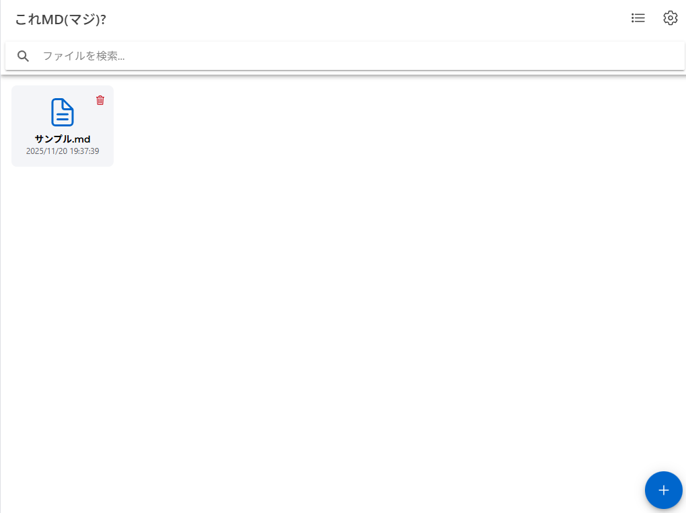

# これＭＤ（マジ）？ / KoreMD (Really)?

<div align="center">


**Simple Markdown Editor supporting Moldova 🇲🇩**

[](https://opensource.org/licenses/MIT)
[](https://ionicframework.com/)
[](https://vuejs.org/)

[English](#english) | [日本語](#japanese)

</div>

---

## <a name="english"></a>🇬🇧 English

### About

**KoreMD** is a simple, elegant Markdown editor built with Ionic and Vue 3. The name plays on multiple meanings:
- **Kore MD** = "This is Markdown?"
- **MD** also represents **Moldova** 🇲🇩 - this project supports Moldovan people and Ukranian refugees there

### Features

- ✨ **Simple & Clean Design** - Minimal, distraction-free interface
- 📝 **Markdown Editor** - Real-time editing with syntax toolbar
- 👁️ **Live Preview** - Switch between edit and preview modes
- 📱 **Cross-Platform** - Works on iOS, Android, Web, and Desktop (Electron)
- 🌐 **Multi-language** - Japanese and English support
- 🎨 **Customizable** - Adjust font size and family
- 💾 **Import/Export** - Easy file management with enhanced compatibility
- 🔒 **Local Storage** - Your data stays on your device
- 🇲🇩 **Moldova Support** - Design inspired by Moldovan flag colors
- 🔍 **Search Function** - Find text within your documents
- ⌨️ **IME Support** - Full support for Japanese, Chinese, and Korean input

### Screenshots



<br>


### Installation

#### Mobile (iOS/Android)
```bash
# Install dependencies
npm install

# Run on iOS
npm run ios

# Run on Android
npm run android
```

#### Desktop (Electron)
```bash
# Install dependencies
npm install

# Run Electron
npm run electron

# Build for distribution
npm run electron:build
```

### Development

```bash
# Install dependencies
npm install

# Run development server
npm run dev

# Build for production
npm run build
```

### Technology Stack

- **Framework**: Ionic 7 + Vue 3
- **Language**: TypeScript
- **State Management**: Pinia
- **Markdown Parser**: marked
- **Syntax Highlighting**: highlight.js
- **Internationalization**: vue-i18n

### File Format Support

#### Import
- `.md` - Markdown (recommended)
- `.markdown` - Markdown
- `.txt` - Plain text
- Files from Google Drive, Dropbox, etc.

#### Export
- `.md` - Markdown format
- Share via native OS share sheet (mobile)

### License

MIT License - see [LICENSE](LICENSE) file for details

### Contributing

Contributions are welcome! Please feel free to submit a Pull Request.

### Supporting Moldova 🇲🇩

This project is designed to support Moldovan people and Ukranian refugees there. The app's design incorporates the colors of the Moldovan flag (blue, red, and yellow).

---

## <a name="japanese"></a>🇯🇵 日本語

### 概要

**これＭＤ（マジ）？** は、Ionic と Vue 3 で構築されたシンプルで洗練されたMarkdownエディタです。アプリ名には複数の意味が込められています：
- **これＭＤ（マジ）？** = 「これマジ（本当）？」+ 「Markdown」
- **MD** は **モルドバ（Moldova）** 🇲🇩 も表しており、このプロジェクトはモルドバの方々とそこに住むウクライナ難民の方々を支援しています

### 機能

- ✨ **シンプルでクリーンなデザイン** - ミニマルで集中できるインターフェース
- 📝 **Markdownエディタ** - 装飾文字ツールバー付きリアルタイム編集
- 👁️ **ライブプレビュー** - 編集モードとプレビューモードの切り替え
- 📱 **クロスプラットフォーム** - iOS、Android、Web、デスクトップ（Electron）に対応
- 🌐 **多言語対応** - 日本語と英語をサポート
- 🎨 **カスタマイズ可能** - フォントサイズとフォントファミリーの調整
- 💾 **インポート/エクスポート** - 互換性を向上させた簡単なファイル管理
- 🔒 **ローカルストレージ** - データはデバイス内に保存
- 🇲🇩 **モルドバ支援** - モルドバ国旗の色をモチーフにしたデザイン
- 🔍 **検索機能** - ドキュメント内のテキスト検索
- ⌨️ **IME完全対応** - 日本語・中国語・韓国語入力を完全サポート

### スクリーンショット


<br>


### インストール

#### モバイル版（iOS/Android）
```bash
# 依存関係のインストール
npm install

# iOSで実行
npm run ios

# Androidで実行
npm run android
```

#### デスクトップ版（Electron）
```bash
# 依存関係のインストール
npm install

# Electronで実行
npm run electron

# ビルド
npm run electron:build
```

### 開発

```bash
# 依存関係のインストール
npm install

# 開発サーバーの起動
npm run dev

# プロダクションビルド
npm run build
```

### 技術スタック

- **フレームワーク**: Ionic 7 + Vue 3
- **言語**: TypeScript
- **状態管理**: Pinia
- **Markdownパーサー**: marked
- **シンタックスハイライト**: highlight.js
- **国際化**: vue-i18n

### 対応ファイル形式

#### インポート
- `.md` - Markdown（推奨）
- `.markdown` - Markdown
- `.txt` - プレーンテキスト
- Googleドライブ、Dropbox等からのファイル

#### エクスポート
- `.md` - Markdown形式
- OSネイティブ共有機能で共有（モバイル）

### ライセンス

MIT License - 詳細は [LICENSE](LICENSE) ファイルを参照してください

### コントリビューション

コントリビューションを歓迎します！お気軽にPull Requestを送ってください。

### モルドバ支援について 🇲🇩

このプロジェクトは、モルドバの方々とそこに住むウクライナ難民の方々を支援するために設計されています。アプリのデザインには、モルドバ国旗の色（青、赤、黄）が取り入れられています。

---

## 📚 Documentation / ドキュメント

- [Changelog / 変更履歴](CHANGELOG.md)
- [File Import Improvements / ファイルインポート改善](IMPROVEMENTS.md)
- [IME Fix Technical Details / IME修正技術詳細](IME_FIX_TECHNICAL_DETAILS.md)

---

## 🐛 Known Issues / 既知の問題

現在、重大な既知の問題はありません。問題を発見した場合は、GitHub Issuesでお知らせください。

---

## 🔮 Future Plans / 今後の予定

- [ ] ダークモードの実装
- [ ] クラウド同期機能（オプション）
- [ ] Markdownテーブル編集の強化
- [ ] 画像の直接貼り付け
- [ ] ファイルのカテゴリー/タグ管理
- [ ] エクスポート形式の拡張（HTML、PDF）
- [ ] キーボードショートカット
- [ ] 印刷機能

---

<div align="center">

Made with ❤️ by PYU224

Supporting Moldova 🇲🇩 | モルドバを支援 🇲🇩

Links<br>
https://linksta.cc/@pyu224

</div>